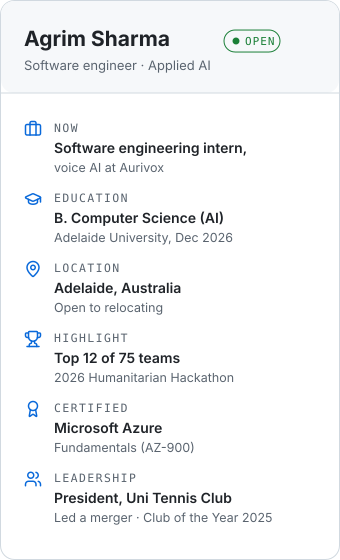
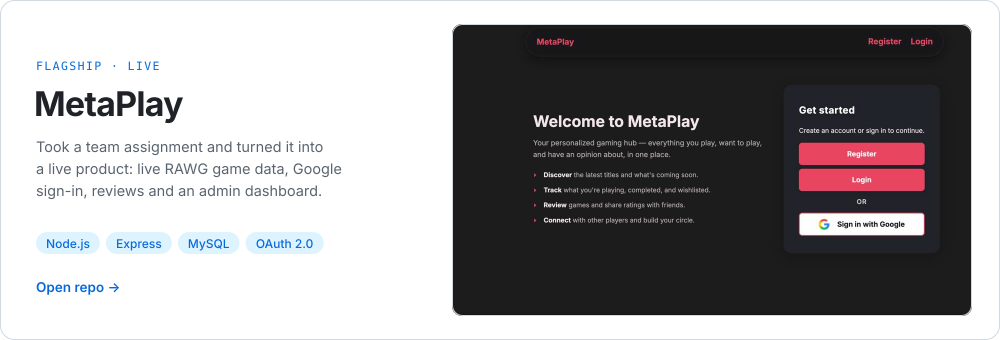
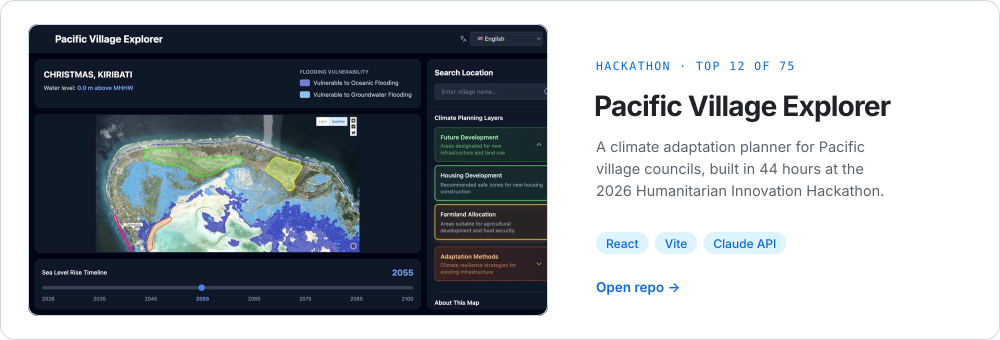

  <a href="https://agrimsharma.com"><picture><source media="(prefers-color-scheme: dark)" srcset="./btn-portfolio-dark.svg"></picture></a>
  <a href="https://agrimsharma.com/resume.pdf"><picture><source media="(prefers-color-scheme: dark)" srcset="./btn-resume-dark.svg"></picture></a>
  <a href="https://linkedin.com/in/agrim-sharma-821788302"><picture><source media="(prefers-color-scheme: dark)" srcset="./btn-linkedin-dark.svg"></picture></a>
  <a href="mailto:agrimsh22@gmail.com"><picture><source media="(prefers-color-scheme: dark)" srcset="./btn-email-dark.svg"></picture></a>

<picture><source media="(prefers-color-scheme: dark)" srcset="./bB-card-dark.svg"></picture>

## <picture><source media="(prefers-color-scheme: dark)" srcset="./icon-about-dark.svg"></picture>&nbsp; About me

I'm a final-year Computer Science student at Adelaide University, majoring in AI. I build full-stack web apps, put AI inside them, and care most about shipping software real people use.

**What I bring**

- Full-stack delivery, from database to deployed UI, in TypeScript, Java and Python
- Practical AI integration: streaming LLM features through secure server routes
- Shipping under pressure: a working product in 44 hours at a hackathon
- Leadership: as club president I led a merger of two clubs, grew membership from 10 to over 100, and we won Club of the Year 2025

**Currently** interning on voice AI at Aurivox, and looking for graduate software engineering roles from December 2026.

 

## <picture><source media="(prefers-color-scheme: dark)" srcset="./icon-projects-dark.svg"></picture>&nbsp; Featured work

<a href="https://github.com/Agrim1305/Metaplay"><picture><source media="(prefers-color-scheme: dark)" srcset="./bC-metaplay-dark.svg"></picture></a>

<a href="https://github.com/reeyansh404/Pacific-Village-Explorer"><picture><source media="(prefers-color-scheme: dark)" srcset="./bC-pacific-dark.svg"></picture></a>

More of my code is pinned below. The AI assistant on my portfolio is live at <a href="https://agrimsharma.com">agrimsharma.com</a>.

## <picture><source media="(prefers-color-scheme: dark)" srcset="./icon-stack-dark.svg"></picture>&nbsp; Tech stack

  <picture><source media="(prefers-color-scheme: dark)" srcset="https://skillicons.dev/icons?i=ts,js,py,java,cpp,react,nextjs,nodejs,express,spring,tailwind,postgres,mysql,azure,docker,git&perline=8&theme=dark"></picture>

## <picture><source media="(prefers-color-scheme: dark)" srcset="./icon-contact-dark.svg"></picture>&nbsp; Let's talk

I'm looking for graduate software engineering roles from December 2026. Email me at **[agrimsh22@gmail.com](mailto:agrimsh22@gmail.com)** or grab my **[résumé](https://agrimsharma.com/resume.pdf)**.
