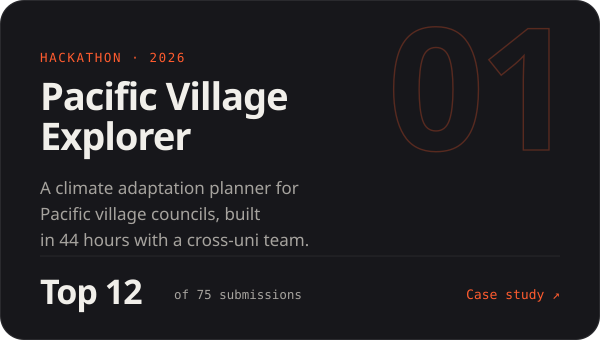
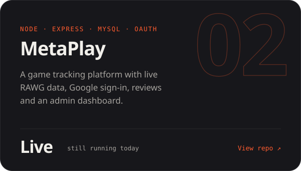
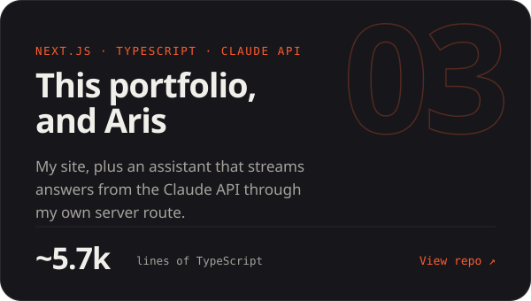
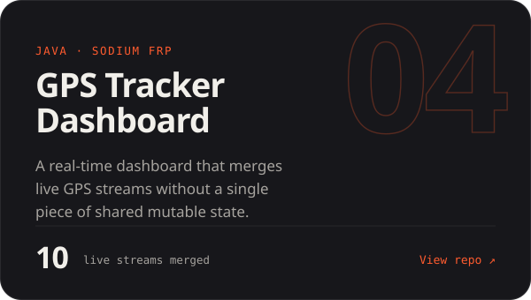

  
  
  

### Hi, I'm Agrim.

Final-year Computer Science student at **Adelaide University**, majoring in Artificial Intelligence and graduating December 2026. I build software that solves problems, put AI to work inside them, and ship it so real people actually use it. Right now I'm interning on voice AI at Aurivox.

### Featured repos

  
  
  
  

<b>More repos</b>

 

| Repo | What it is | Stack |
| --- | --- | --- |
| [Pathfinder](https://github.com/Agrim1305/Pathfinder) | BFS, UCS and A* compared on elevation-aware grids | Python |
| [Virtual Restaurant Simulator](https://github.com/Agrim1305/Virtual_Restaurant_Simulator) | Restaurant operations sim: menu, orders, inventory, staff | C++ |
| [TicTacToe_MATLAB](https://github.com/Agrim1305/TicTacToe_MATLAB) | Two-player GUI game with undo and reset | MATLAB |

### Toolkit

### Beyond the code

I coach junior tennis and led the Adelaide University Tennis Club through a merger as president, taking it to 100+ members and Club of the Year. Running a committee turns out to be good training for shipping software: work out who needs what, then clear the path.

 

